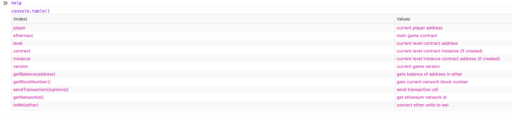
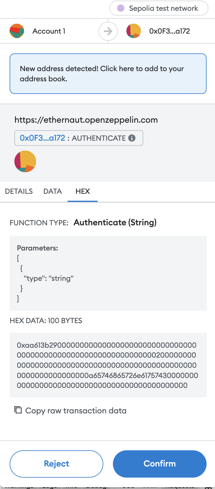

# Hello Ethernaut

This level walks you through the very basics of thow to play the game:

Let's first start by creating the level instance, this can be done by clicking "Get New Instance" button.

We can now open the browser console and start testing, we can for example print our address by typing `player` in the console. Or get our current balance using `await getBalance(player)`.

**Note: When stuck, we can always type `help()` to print the available helper methods and their description**



### Level Completion

Now let's start interacting with the contract and complete the level:

let's look into the level's info method

```javascript
>  await contract.info()
<· "You will find what you need in info1()."
```

we follow the instruction in each method:

```javascript
>  await contract.info1()
<· "Try info2(), but with \"hello\" as a parameter."

>  await contract.info2("hello")
<· "The property infoNum holds the number of the next info method to call."

>  (await contract.infoNum()).toString()
<· "42"

>  await contract.info42()
<· "theMethodName is the name of the next method."

>  (await contract.theMethodName()).toString()
<· "The method name is method7123949."

>  await contract.method7123949()
<· "If you know the password, submit it to authenticate()."
```

Now let's print the password variable and then call authenticate() :

```javascript
>  (await contract.password()).toString()
<· "ethernaut0"

>  await contract.authenticate("ethernaut0")
```

Now we will be prompted with a metamask transaction. As we can see in the image below, this a function call to authenticate() with "ethernaut0" as parameter **(65746865726e61757430 is hexcode of the string "ethernaut0")**



After confirming the transaction and waiting for it to be mined, we can now click "Submit Instance" button.

### ***Congratulations! You have completed the tutorial.***